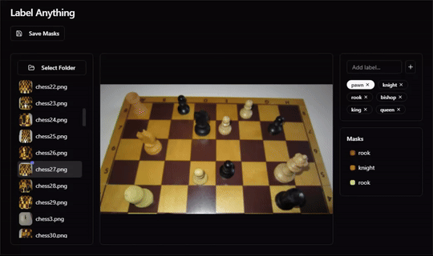

# Label Anything

## Instructions

- Open a folder containing images using the "Select Folder" button
- Click on an image to open it (it will take a few seconds to create embeddings)
- Create labels in the "Add Label" section
- Click to start labeling
  - `Left Click` to add a positive point
  - `Shift + Left Click` to add a negative point
  - `Enter` commit the current points
  - `Escape` to cancel the current points (keeps committed masks)
- To delete a mask press `Delete` or press the "Trash" button in the masks list
- Click "Save Masks" to save the masks to a file on your local filesystem
